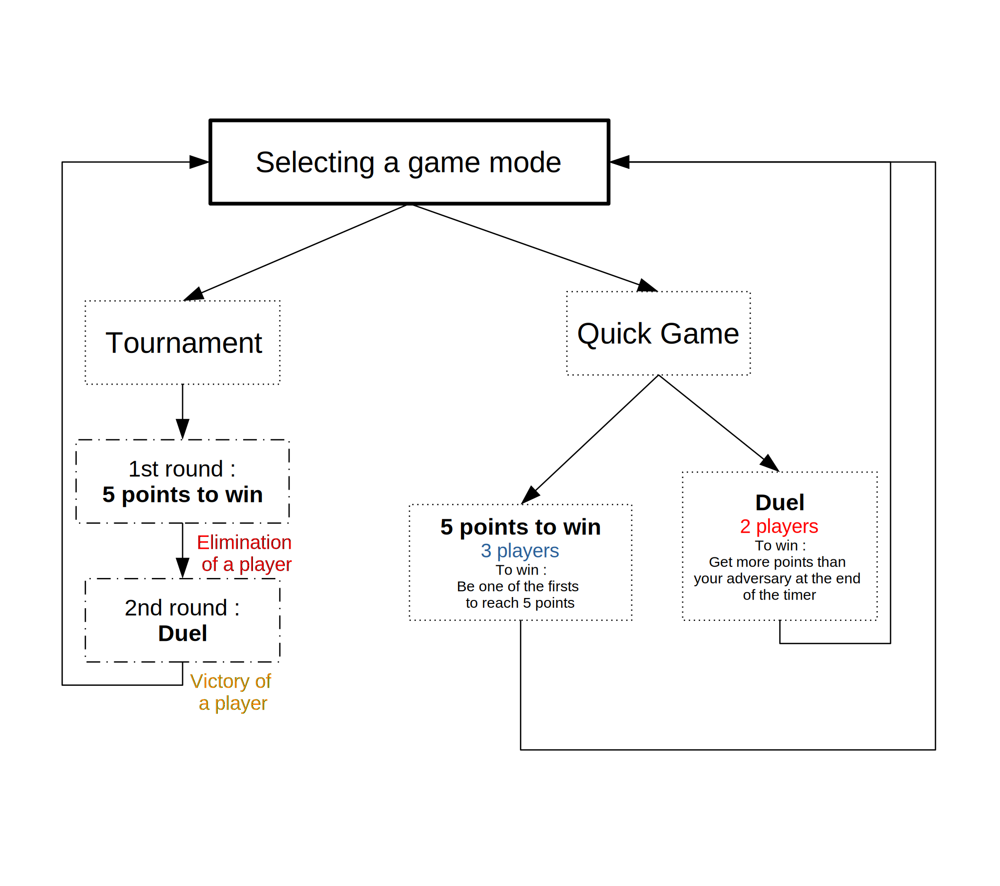

# BuzzQuizz
Arduino file to run the set of 3 colored buttons connected to the game master interface.

After a question is asked, any player can press their corresponding button to answer. The game master can then increase or decrease by one their score, or reset the game.

# Requirements

Check the required packages at the beginning of the file.

# Installation 

To use it, upload it to the Arduino Uno via Arduino IDE.

# Game modes

